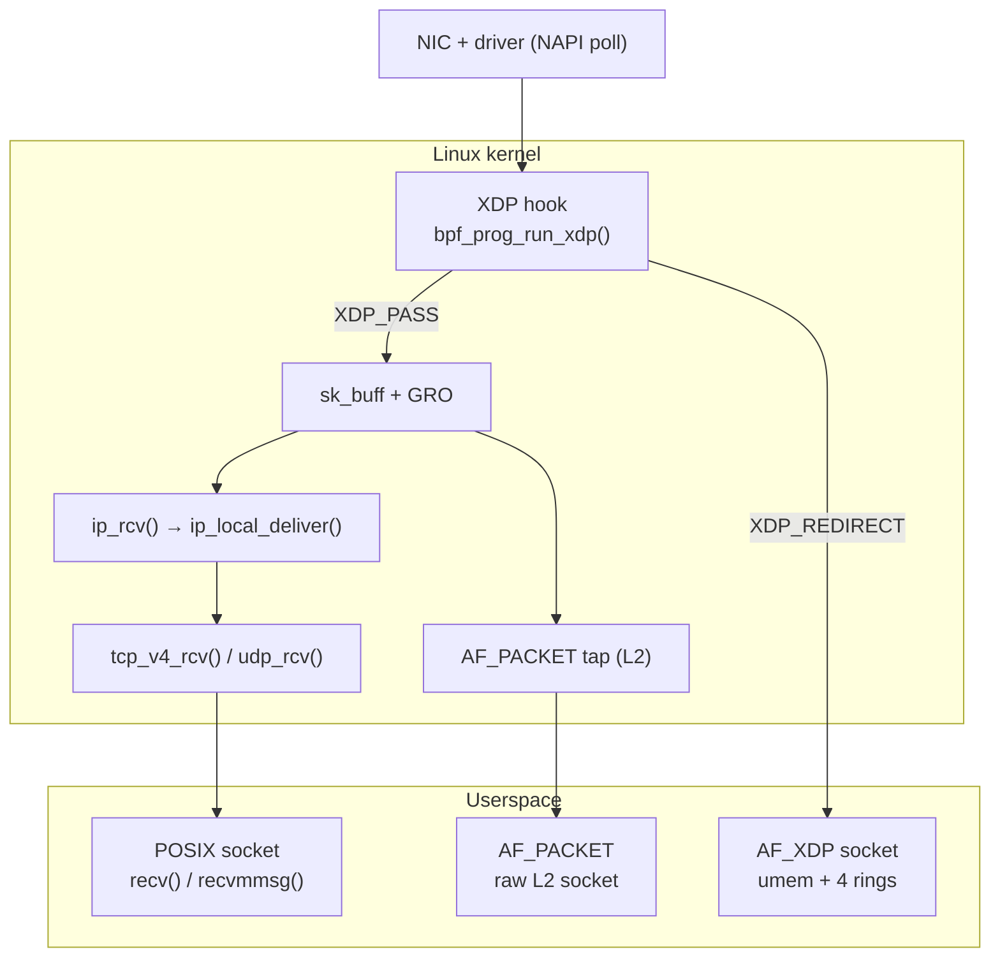
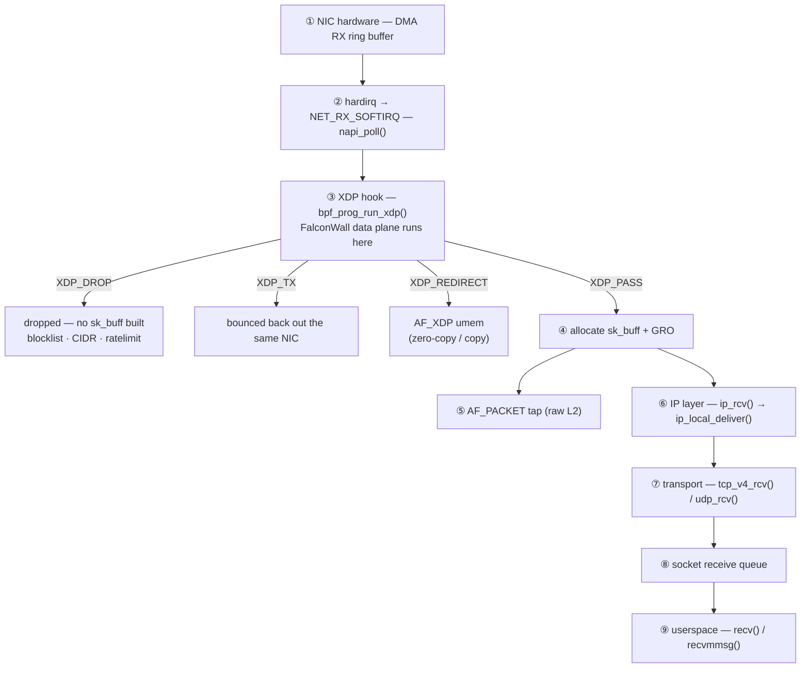
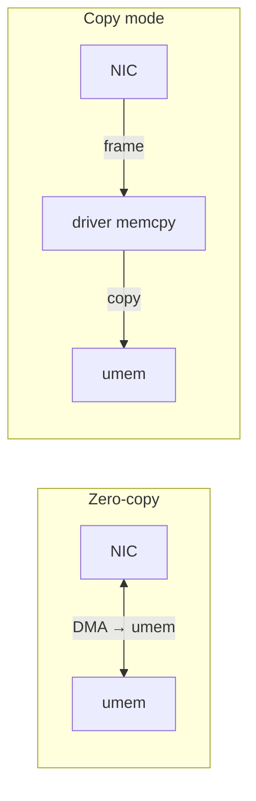
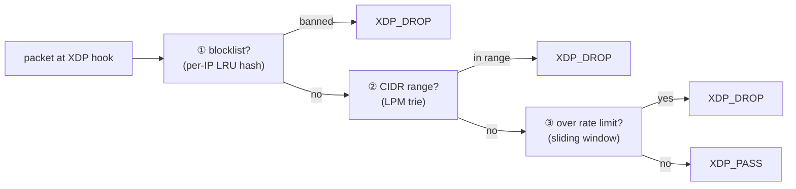

# FalconWall

**Line-rate DDoS mitigation and packet-I/O benchmarking on Linux, built on
eBPF/XDP.**

Plain-markdown fallback: [`README.ascii.md`](README.ascii.md).

FalconWall drops malicious traffic at the XDP hook — before the kernel even
builds an `sk_buff` — and measures exactly how fast packets can move through
the Linux stack.

---

## Highlights

**⚡ 1M packets/sec at 0% loss, using 41% CPU.**

FalconWall's AF_XDP backend reaches line rate while the POSIX socket backend
saturates at ~750K pps with 24% packet loss and 66% CPU. Measured on a
**Google C3 VM (4 vCPU, gVNIC NIC, 23 Gb/s link)**.

| Backend | PPS @ 0% loss | CPU @ 1M pps |
|---|---|---|
| POSIX socket | ~500K | 66% |
| AF_PACKET | ~500K | 74% |
| **AF_XDP (FalconWall)** | **~1.0M** | **41%** |

**🛡️ DDoS defense at the earliest point in the stack.**

The mitigator blocks source IPs, drops entire subnets, and rate-limits per-IP
packet rates entirely in the eBPF data plane — with a plugin engine that
auto-detects and bans attack patterns (SYN floods, UDP floods, ICMP floods).

---

## Repository layout

```
FalconWall/
├── wall/                # DDoS mitigator (self-contained, Makefile build)
│   ├── Makefile
│   ├── fw_prog.c         # BPF data plane (XDP program)
│   ├── fw.cpp            # userspace control plane (CLI)
│   ├── detector.hpp      # plugin interface (Strategy + Registry)
│   └── detector.cpp      # built-in detector plugins
└── benchmark/            # packet I/O benchmark framework (CMake build)
    ├── CMakeLists.txt
    ├── include/          # public headers
    ├── src/              # core + backends (socket, af_packet, af_xdp)
    ├── bench/            # benchmark executables
    ├── docs/             # architecture + benchmark results
    └── scripts/          # traffic-generation helpers
```

---

## Architecture

### The Linux RX path — where everything sits



### Packet traversal, step by step

A received packet's full journey through the kernel, with the earliest drop
points marked. FalconWall runs at **③** — before an `sk_buff` even exists.



### AF_XDP data plane

Two receive modes over a shared `umem` (a contiguous pool of packet buffers in
user memory):



Four rings coordinate the driver and the application (all `mmap`-shared):

| Ring | Direction | Purpose |
|---|---|---|
| **RX** | driver → app | descriptors for received packets (pointers into `umem`) |
| **FILL** | app → driver | empty frames handed back for the driver to reuse |
| **COMPLETION** | driver → app | TX frames the driver has finished transmitting |
| **TX** | app → driver | packets the app wants to transmit |

---

## 1. DDoS Mitigator (`wall/`)

A stateless firewall attached to the XDP hook. All traffic decisions happen in
the eBPF **data plane**; userspace only manages state via pinned BPF maps.

### Architecture

- **Data plane** (`fw_prog.c`, in-kernel) — each step is one cheap map lookup:
  1. **blocklist** — per-IP LRU hash, drop if present and unexpired.
  2. **CIDR range drop** — LPM trie, drop whole subnets with a single lookup.
  3. **sliding-window rate limit** — per-IP packet rate + rich per-IP stats.
  4. otherwise `XDP_PASS`.



- **Control plane** (`fw.cpp`, userspace) — loads/attaches the program, pins
  maps to `/sys/fs/bpf/falconwall/`, updates them at runtime.

### Features

- Per-IP **blocklist** with optional auto-expiry (permanent or timed bans).
- **CIDR range dropping** via LPM trie (`10.0.0.0/8`).
- **Sliding-window rate limiting** per source IP (smooth, no boundary bursts;
  shift-only math because the BPF verifier rejects 64-bit division).
- **Rich per-IP stats** (`packets`, `bytes`, `syn`, `udp`, `icmp` + sliding
  window) stored for detector plugins to consume.
- **Detector plugins** — compile-time, via Strategy + Registry pattern.
- Live packet counters (rx / dropped / passed, per-CPU aggregated).

### Building

Requirements: `clang`, `libbpf` + `libxdp` (with headers), `libelf`, `zlib`.

```sh
cd wall
make            # produces `falconwall` (userspace) and `fw_prog.o` (BPF)
```

Requires root to attach. `falconwall start` tries native (DRV) XDP first and
falls back to generic (SKB) mode.

### Usage

```sh
sudo ./falconwall start <iface>         # load + attach + pin maps + live stats
sudo ./falconwall block 1.2.3.4 60      # block an IP for 60s (0/omit = permanent)
sudo ./falconwall unblock 1.2.3.4
sudo ./falconwall range 10.0.0.0/8      # drop an entire subnet
sudo ./falconwall unrange 10.0.0.0/8
sudo ./falconwall ratelimit 1000        # per-IP rate limit (0 = off)
sudo ./falconwall enable | disable      # toggle mitigation
sudo ./falconwall watch 60              # run detectors, auto-ban offenders for 60s
sudo ./falconwall stats                 # print counters once
```

The `block`/`range`/`ratelimit`/… commands open the pinned maps directly, so
they work while the daemon is running — no restart needed.

### Detector plugins

Detectors are **compile-time plugins**: a `Detector` subclass implementing
`match(ip, stats)`. The `watch` loop iterates all registered detectors and
bans any IP that matches.

```cpp
class SynFloodDetector : public Detector {
    bool match(uint32_t ip, const IpStats& s) const override {
        return s.packets > 50 && s.syn * 10 > s.packets * 8;  // >80% SYN
    }
};
REGISTER_DETECTOR(SynFloodDetector);
```

Adding a detector = one class + one registration line (then add its `.cpp` to
the Makefile). The `watch` loop never changes. Built-in: `rate`, `synflood`,
`udpflood`, `icmpflood`.

---

## 2. Packet I/O Benchmark (`benchmark/`)

Benchmarks the Linux packet I/O stack **top to bottom** by running the *same*
workload against progressively lower-level backends:

```
POSIX Socket  →  AF_PACKET (raw L2)  →  AF_XDP (copy)  →  AF_XDP (zero-copy)
```

Backends are selected at compile time (CRTP/templates, no virtual dispatch in
the hot path) and share one zero-copy parser (Ethernet → IPv4 → TCP/UDP).

### Building

Requirements: `cmake`, `pkg-config`, `clang`, `libbpf` + `libxdp`.

```sh
cd benchmark
cmake -S . -B build
cmake --build build
```

### Usage

```sh
sudo taskset -c 2 ./build/falcon-rxbench xdp    ens4 30   # AF_XDP copy mode
sudo taskset -c 2 ./build/falcon-rxbench xdp-zc ens4 5    # zero-copy (probe)
sudo taskset -c 2 ./build/falcon-rxbench packet ens4 30   # AF_PACKET
sudo taskset -c 2 ./build/falcon-rxbench socket 9100 30   # POSIX socket
```

Full methodology and results (including the 1M pps / 0% loss numbers above)
are in [`benchmark/docs/`](benchmark/docs/).

---

## Requirements (summary)

- Linux kernel with XDP support (5.x+; native mode depends on the NIC driver).
- `clang` (BPF compilation), `libbpf`, `libxdp`, `libelf`, `zlib`.
- `cmake` + `pkg-config` for the benchmark framework.
- Root privileges to attach XDP programs and pin BPF maps.
